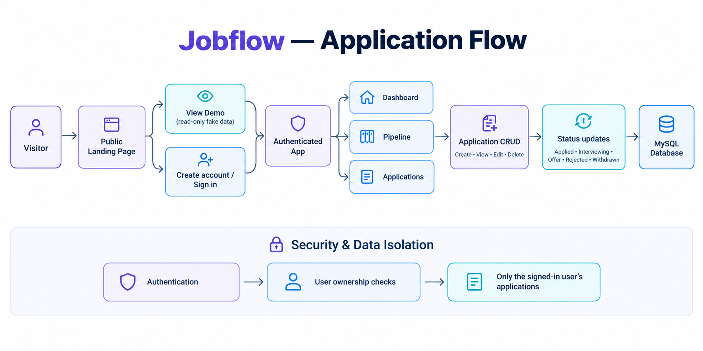
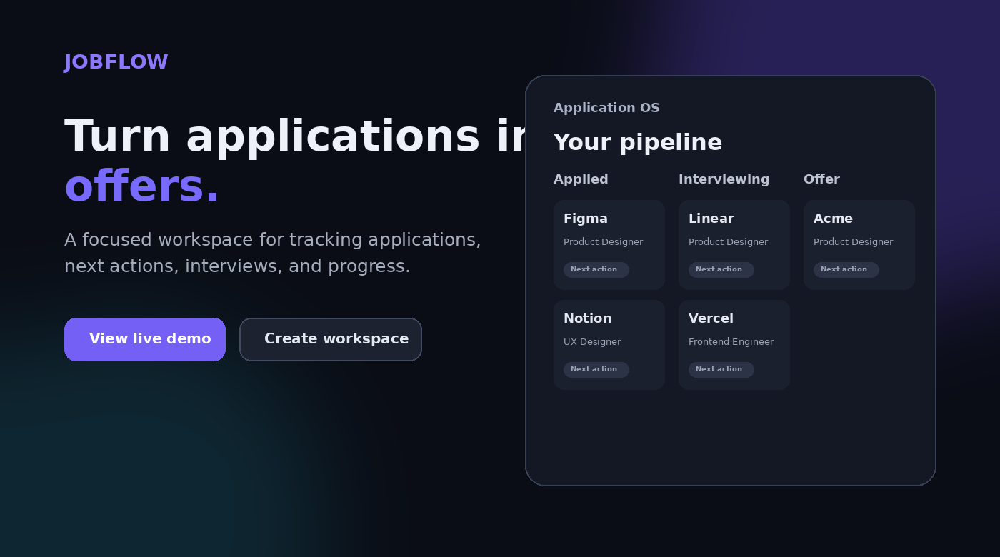
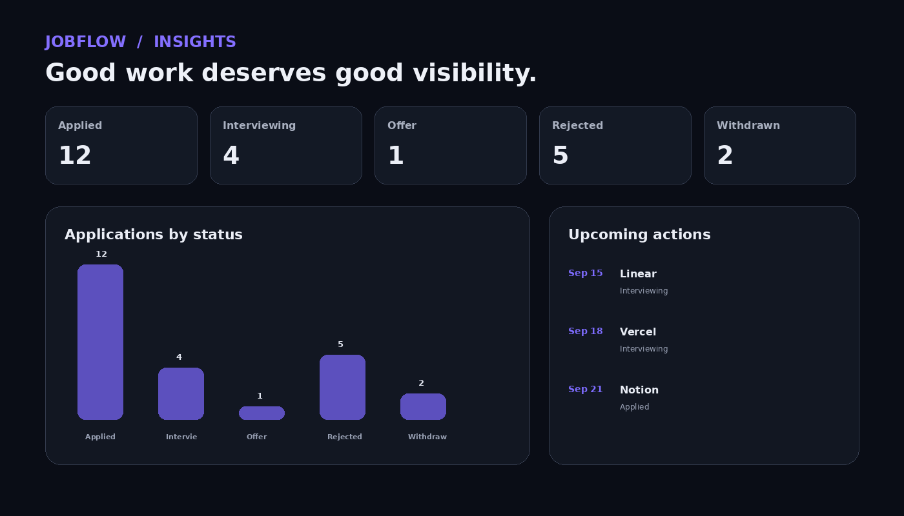
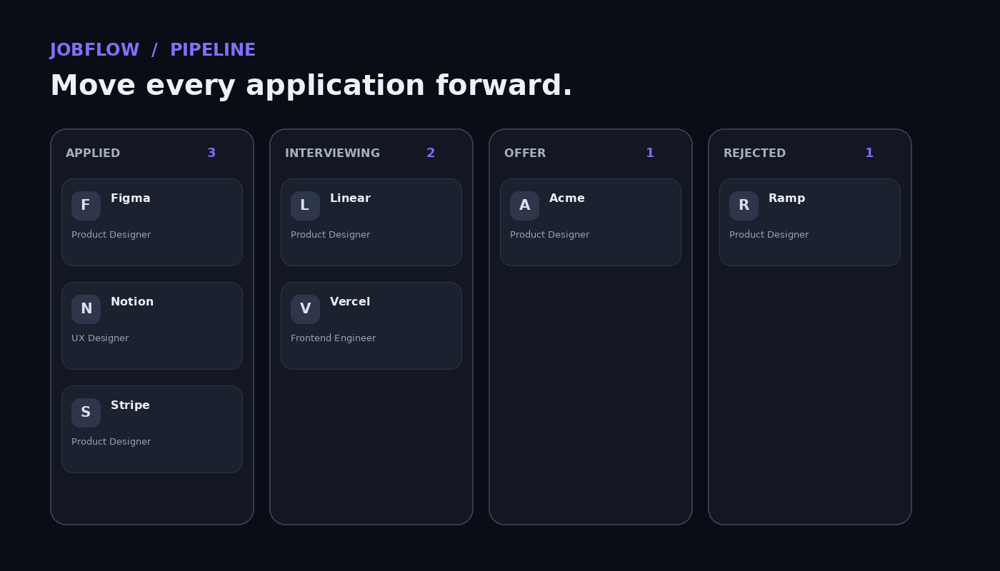

# Jobflow — Application OS

> A modern Django SaaS-style job application tracker designed to help job seekers organize applications, manage interview progress, and keep their job search moving.

## 🚦 Application Flow



The flow above gives a quick visual overview of how a visitor moves from the public landing page into Demo Mode or authentication, then into the protected application workspace.

## 🖥️ Project Showcase

A quick visual tour of the current Jobflow interface.

### Landing Page



### Dashboard



### Application Pipeline



## ✨ What is Jobflow?

Jobflow is a full-stack Django web application for managing a job search from application to outcome.

Instead of keeping applications across spreadsheets, browser tabs, notes, and reminders, Jobflow brings the workflow into one focused workspace.

**Core workflow:**

`Discover → Apply → Track → Interview → Follow up → Offer / Outcome`

## 🚀 Highlights

- Modern SaaS-style responsive interface
- Public landing page
- Read-only Demo Mode with sample data
- User registration and authentication
- Personal application pipeline
- Kanban-style status tracking
- Application create / edit / delete
- Search and filtering
- Dashboard statistics
- Upcoming-action tracking
- User-owned application data isolation
- Django backend with MySQL-compatible persistence
- Reusable templates, CSS, and JavaScript

## 📚 Project Documentation

Detailed project documentation is included in the repository:

| Document | What it covers |
|---|---|
| 📘 [User Manual](docs/01_Jobflow_User_Manual.pdf) | Complete guide to using Jobflow with practical examples |
| 🧠 [Project Deep Dive](docs/02_Jobflow_Project_Deep_Dive.pdf) | Product, architecture, Django structure, database, frontend, security, and engineering decisions |
| 🐛 [Issues & Lessons Learned](docs/03_Jobflow_Issues_and_Lessons_Learned.pdf) | Real debugging challenges, fixes, decisions, and lessons learned |
| 🗺️ [Application Flow](docs/jobflow_application_flow.png) | Visual overview of the complete application flow |

## 🏗️ Architecture

```text
Browser
   │
   ▼
Django URLs
   │
   ▼
Views + Forms
   │
   ├── Authentication
   ├── Application CRUD
   ├── Status Updates
   └── Dashboard Data
   │
   ▼
Django Models
   │
   ▼
MySQL Database
```

The frontend uses Django templates with CSS and vanilla JavaScript for interactive behaviour such as pipeline actions, dashboard interactions, filtering, and UI enhancements.

## 🛠️ Tech Stack

**Backend**
- Python
- Django

**Frontend**
- HTML
- CSS
- JavaScript
- Django Templates

**Database**
- MySQL / MySQL-compatible relational database

**Development & Deployment**
- Git / GitHub
- Gunicorn-ready `Procfile`
- Environment-based configuration

## 🔐 Security & Privacy

Jobflow is designed around authenticated, user-owned application data.

- Authentication protects private application pages.
- Application queries are scoped to the signed-in user.
- Secrets and local environment files are excluded from Git.
- Production deployment should use environment variables for credentials and secret configuration.
- Demo Mode uses fictional sample data rather than personal application records.

## 💻 Local Setup

Clone the repository:

```bash
git clone https://github.com/dev-kiruba/jobflow---application-tracker.git
cd jobflow---application-tracker
```

Create a virtual environment:

```bash
python -m venv venv
```

Activate it on Windows:

```powershell
venv\Scripts\activate
```

Install dependencies:

```bash
pip install -r requirements.txt
```

Create your local environment configuration from `.env.example`.

Run database migrations:

```bash
python manage.py migrate
```

Start the development server:

```bash
python manage.py runserver
```

Then open:

```text
http://127.0.0.1:8000/
```

## 🧪 Main Routes

| Route | Purpose |
|---|---|
| `/` | Public landing page |
| `/demo/` | Public read-only demo |
| `/login/` | User login |
| `/register/` | User registration |
| `/app/` | Authenticated application workspace |
| `/app/dashboard/` | Dashboard |
| `/app/applications/` | Application list |

## 🎯 Why I Built It

Jobflow started as a simple job application tracker and evolved into a more complete SaaS-style product through iterative design, debugging, and feature improvements.

The project focuses on more than making CRUD operations work. It explores:

- product-oriented UI design
- practical Django architecture
- authenticated multi-user data handling
- interactive workflow design
- debugging and problem solving
- documentation
- production deployment preparation

## 📈 Future Roadmap

Planned improvements include:

- Interview tracking
- Follow-up reminders
- richer analytics
- job-source tracking
- email/calendar integrations
- improved mobile experience
- production deployment
- custom domain
- additional automation

## 👤 Author

**Kiruba**

Built as a portfolio project demonstrating full-stack Python/Django development, product thinking, UI/UX iteration, debugging, and deployment readiness.
